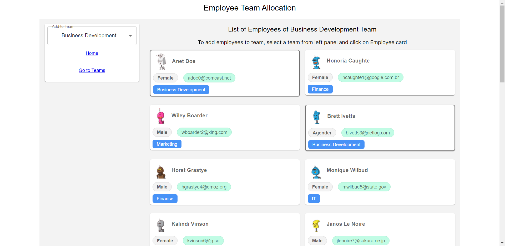
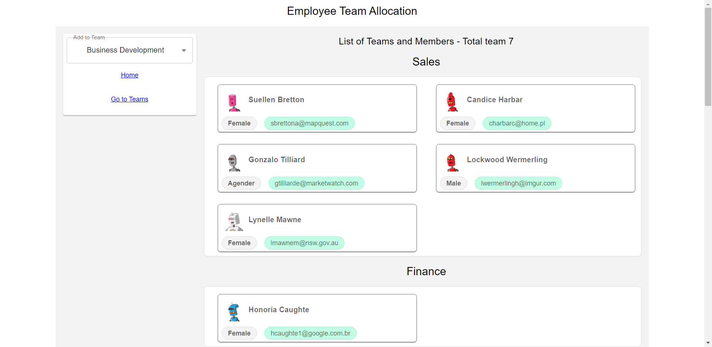

# Team Allocation App in React with Material UI

**Team Allocation Frontend**

- To use api url create a **.env** file and create a environment variable **VITE_BASE_URL='https://anish-mockapi.onrender.com'**

**Screenshots**

